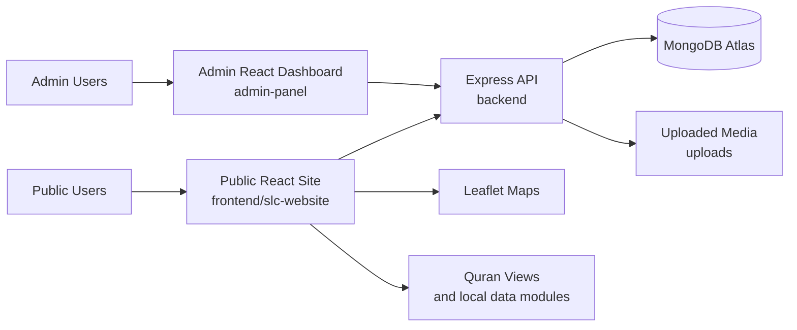

# Shahjalal Library Corner

## Upload First (GitHub)

Push these paths first so the repo builds correctly:

- `README.md`
- `.gitignore`
- `backend/`
- `admin-panel/`
- `frontend/slc-website/`
- `images/readme images/`
- `images/Mazar/`
- `images/SUST/`
- `uploads/.gitkeep`
- `starter.ps1`

Do not upload local build/dependency/secrets:

- any `node_modules/`
- any `build/` or `dist/`
- any `.env`
- temporary dumps and duplicate backup folders

For a full checklist, see `UPLOAD_FILES.md`.

Shahjalal Library Corner is a full-stack digital heritage, Islamic knowledge, and library platform built around Hazrat Shahjalal (Rah.), Shahjalal University of Science and Technology (SUST), and the SUST Central Library Islamic Corner.

The project combines a public website, an authenticated admin dashboard, and an Express/MongoDB backend so books, quotes, timeline content, auliyas, videos, gallery items, mazar locations, and research requests can all be managed from one codebase.

## Live Link

- Vercel URL: https://abcslc.vercel.com
- Local public site: http://localhost:3010
- Local backend API: http://localhost:5010
- Local admin panel: http://localhost:8010

## Project Context

This platform was built to reflect the original website requirements:

- a heritage-centered homepage for SUST, Shahjalal Library Corner, and Hazrat Shahjalal (Rah.)
- dedicated sections for biography, timeline, teachings, books, quotes, companions, maps, and research
- a public-facing Islamic library experience with downloadable and readable resources
- map-based discovery for the SUST library, the dargah, and regional mazar locations
- a full admin workflow so content changes do not require hardcoded edits

## Applications

### Public Website

Path: `frontend/slc-website`

The public application includes:

- homepage storytelling with Islamic and academic identity
- about page for Shahjalal Library Corner and SUST context
- detailed life and timeline presentation for Hazrat Shahjalal (Rah.)
- teachings section with quotes, books, and Quran exploration
- companions and auliyas presentation
- locations page with live maps and mazar directory
- research request page for visitors and researchers
- developers page with project and contributor details

### Admin Dashboard

Path: `admin-panel`

The admin dashboard provides:

- JWT-based admin login
- CRUD interfaces for books, authors, quotes, timeline, auliyas, gallery, requests, settings, and videos
- upload flows for images, PDFs, and video-related assets
- content management without editing source code directly

### Backend API

Path: `backend`

The backend handles:

- admin authentication
- protected CRUD APIs
- file upload handling
- public content aggregation
- Quran and mazar data endpoints
- MongoDB Atlas data persistence

## Technical Architecture

### Frontend Architecture

The public site is a React application that uses client-side routing and a content-rich page structure aligned with the original requirements.

- Routing: React Router with hash-based routing for simple static hosting compatibility
- UI behavior: Framer Motion is used for animations and staged presentation
- Maps: React Leaflet is used for the live location experience
- Quran pages: dedicated Quran list and surah detail views are rendered from app data and API-backed content
- Asset handling: public-facing photos and screenshots live under the project image directories
- API communication: the frontend points to `http://localhost:5010/api` locally through environment configuration or built-in defaults

### Admin Architecture

The admin panel is a separate React app focused on content operations.

- Authentication: login issues a JWT through the backend and stores the token in local storage
- Section model: one dashboard shell with multiple section-specific CRUD views
- Upload support: multipart upload flows are used where media is required
- Seeded content workflow: the panel is designed to operate against demo/sample data for local development
- API target: the admin app also uses the backend API at `http://localhost:5010/api` locally

### Backend Architecture

The backend is an Express server backed by Mongoose models.

- Runtime: Node.js + Express
- Database layer: Mongoose models for books, authors, quotes, videos, settings, auliyas, gallery items, timeline events, users, and research requests
- Auth: JWT for protected admin routes
- Password security: bcryptjs for password hashing and verification
- Uploads: Multer for handling book covers, PDFs, gallery media, timeline assets, auliya media, and video assets
- Data source split: some content is dynamic from MongoDB, while Quran-related content also uses local JSON/data modules where appropriate

### Data Flow

The main runtime flow looks like this:

1. The public frontend loads page-level content and calls backend APIs for dynamic data.
2. The admin dashboard authenticates against the backend and receives a JWT token.
3. Protected admin actions send authenticated requests to CRUD endpoints.
4. The backend validates the token, processes data or uploads, and writes to MongoDB Atlas.
5. Updated content is then reflected back into the public site through API reads.

### Deployment Shape

The repository is structured so the applications can be deployed independently.

- Public website: suitable for static/frontend hosting such as Vercel
- Backend API: requires a Node.js host with access to MongoDB Atlas
- Admin dashboard: can be hosted separately as a React build or internal dashboard deployment

If the public site is hosted on Vercel, the backend API still needs its own deploy target unless you later migrate it into a compatible serverless architecture.

### Architecture Diagram



## Tech Stack

- Frontend: React, React Router, Framer Motion, React Leaflet, React PDF, Lucide React
- Admin: React, Tailwind CSS, Framer Motion, Lucide React
- Backend: Node.js, Express, Mongoose, JWT, bcryptjs, Multer
- Database: MongoDB Atlas
- Automation: PowerShell starter script and Playwright-based screenshot capture scripts

## Repository Structure

```text
backend/                     Express API, models, routes, upload logic
frontend/slc-website/        Public React website
admin-panel/                 Admin React dashboard
images/                      Source photos and generated README screenshots
uploads/                     Runtime upload directory
starter.ps1                  Local Windows startup helper
README.md                    Root project documentation
```

## Screenshots

### Public Website

#### Home Page


#### About Page


#### Locations And Maps


#### Teachings And Quran Exploration


#### Quran Surah Index


#### Quran Surah Detail


#### Book List


#### Timeline


#### Developer Page


### Admin Dashboard

#### Admin Login


#### Books Management


#### Authors Management


#### Quotes Management


#### Timeline Management


#### Auliyas Management


#### Gallery Management


#### Research Requests Management


#### Settings Management


#### Videos Management


## Key Features

- Bangla-focused navigation and presentation aligned with the SLC identity
- homepage sections for SUST, the dargah, photo gallery, video gallery, timeline, and companions
- detailed biography and timeline experience for Hazrat Shahjalal (Rah.)
- searchable Islamic book collection with read/download actions
- Quran exploration with full surah listing and surah detail page
- quote and teachings modules related to Islamic learning and Hazrat Shahjalal (Rah.)
- live maps for SUST Library and Hazrat Shahjalal (Rah.) Dargah with a wider Sylhet mazar map
- research request workflow for public users
- seeded admin-ready content management for all main sections

## Local Setup

### Prerequisites

- Node.js and npm
- MongoDB Atlas connection string
- Windows PowerShell if using the provided starter script

### Environment

Keep real secrets in `backend/.env` and do not commit them.

Example format:

```env
PORT=5010
MONGO_URI=mongodb+srv://<username>:<password>@cluster0.f2nlsyf.mongodb.net/?retryWrites=true&w=majority&appName=Cluster0
JWT_SECRET=replace-with-a-strong-secret
BOOTSTRAP_DEMO_ADMIN=true
DEMO_ADMIN_USERNAME=demo
DEMO_ADMIN_PASSWORD=demo12345
```

### Start With The Script

From the project root:

```powershell
.\starter.ps1
```

This starts:

- backend on `5010`
- public frontend on `3010`
- admin dashboard on `8010`

### Start Manually

Backend:

```powershell
cd backend
npm install
npm start
```

Frontend:

```powershell
cd frontend/slc-website
npm install
npm start
```

Admin:

```powershell
cd admin-panel
npm install
npm start
```

## Demo Admin Access

For local development, demo bootstrap credentials are enabled.

- Username: `demo`
- Password: `demo12345`

The admin login form is prefilled with these demo values for quick local access.

These should be changed before any real deployment.

## API Overview

### Public Routes

- `GET /`
- `GET /api/content/all`
- `GET /api/mazars/sylhet`
- `POST /api/research-request`
- `GET /api/quran/:number`

### Authentication Routes

- `POST /api/auth/register`
- `POST /api/auth/login`

### Protected Admin Routes

- `/api/admin/books`
- `/api/admin/authors`
- `/api/admin/quotes`
- `/api/admin/timeline`
- `/api/admin/auliyas`
- `/api/admin/gallery`
- `/api/admin/requests`
- `/api/admin/settings`
- `/api/admin/videos`

### Upload Routes

- `POST /api/admin/books/upload`
- `PUT /api/admin/books/:id/upload`
- `POST /api/admin/gallery/upload`
- `PUT /api/admin/gallery/:id/upload`
- `POST /api/admin/timeline/upload`
- `PUT /api/admin/timeline/:id/upload`
- `POST /api/admin/auliyas/upload`
- `PUT /api/admin/auliyas/:id/upload`
- `POST /api/admin/videos/upload`
- `PUT /api/admin/videos/:id/upload`

## Screenshot Automation

User site screenshots:

```powershell
cd frontend/slc-website
npm run screenshots
```

Admin site screenshots:

```powershell
cd frontend/slc-website
npm run screenshots:admin
```

Both commands save images to `images/readme images/`.

## GitHub Upload With PAT

Use this flow after replacing placeholders:

```powershell
cd "<project-root>"
git init
git add .
git commit -m "feat: rebuild SLC admin/user docs, screenshots, and config"
git branch -M main
git remote add origin https://<GITHUB_USERNAME>:<PAT_TOKEN>@github.com/<GITHUB_USERNAME>/<REPO_NAME>.git
git push -u origin main
```

Security note: after pushing with URL-embedded PAT, rotate that token from GitHub settings.

## GitHub And Deployment Notes

- keep `backend/.env` out of version control
- confirm no personal credentials are present in docs or source files
- push only the required assets and source code
- if the public site is on Vercel, point it to a separately deployed backend API for production data access

## Recommended Next Steps

1. Replace the development secrets and demo credentials before public launch.
2. Host the backend and admin panel in production-ready environments.
3. Connect the Vercel frontend to the final production API base URL.
4. Add build, lint, and deployment validation through CI.
